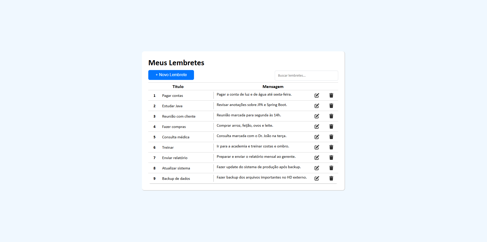

# 📝 Lembretes - CRUD Completo com Java, Spring Boot e Frontend Web

Este projeto é uma aplicação web para gerenciamento de lembretes (anotações simples do dia a dia), com operações completas de **Create, Read, Update e Delete** (CRUD). A aplicação foi construída com **Java + Spring Boot** no backend e uma interface web leve e responsiva utilizando **HTML, CSS e React** no frontend.

## 🚀 Tecnologias Utilizadas

### Backend
- **Java 17+**
- **Spring Boot 3**
- Spring Data JPA
- Spring Web (REST)
- Banco de dados: Mysql
- Lombok

### Frontend
- HTML5
- CSS3
- React
- Axios
- Font Awesome Icons

## 📦 Funcionalidades

- ✅ Criar lembretes com título e descrição
- 📖 Listar todos os lembretes cadastrados
- ✏️ Editar lembretes existentes
- ❌ Excluir lembretes
- 🔍 Buscar lembretes
- 💾 Persistência dos dados com JPA/Hibernate

## 🖼️ Preview da Aplicação

Abaixo um exemplo da interface principal da aplicação:



## 🧪 Como Rodar o Projeto Localmente

### 🔧 Backend (Java + Spring Boot)

Para rodar o backend localmente:

1. Navegue até a pasta `crud-backend`.
2. Abra o arquivo `pom.xml` em uma IDE como **IntelliJ IDEA**.
   - Você pode abrir o `pom.xml` diretamente como projeto ou abrir a pasta como um projeto Maven.
3. Execute o comando Maven abaixo no terminal da IDE ou do sistema:

```bash
mvn clean install
```

4. Após o build, localize a classe `CrudApplication.java` e execute o método `main`.

> Isso iniciará o servidor backend na porta `9571`.

---

### 🌐 Frontend (Node.js + React)

Para rodar o frontend:

1. Abra um terminal e navegue até a pasta `crud-frontend`.
2. Verifique se o **Node.js** está instalado no seu sistema.
3. Com o terminal aberto dentro da pasta, execute os seguintes comandos:

```bash
npm install
npm start
```

> O frontend será iniciado automaticamente no navegador em `http://localhost:3000`, consumindo a API do backend em `http://localhost:9571`.

---

## 🗂️ Estrutura do Projeto

```
lembretes-crud/
├── crud-backend/          # Backend Spring Boot
│   ├── src/
│   ├── pom.xml
│   └── ...
│
├── crud-frontend/         # Frontend com JS/React
│   ├── src/
│   ├── public/
│   └── package.json
│
└── README.md
```

---

## 💡 Melhorias Futuras

- [ ] Autenticação com JWT  
- [ ] Layout responsivo  
- [ ] Deploy em nuvem (Render, Vercel, Railway...)  

---

## 🤝 Contribuindo

Contribuições são bem-vindas!  
Achou um bug? Quer sugerir uma melhoria?  
Abra uma issue ou envie um pull request!

---

## 📄 Licença

Este projeto está sob a licença MIT. Consulte o arquivo [LICENSE](./LICENSE) para mais detalhes.

---

Feito com 💻, café e filmes do Tom Cruise por [Andre Sousa](https://github.com/idewizard)
